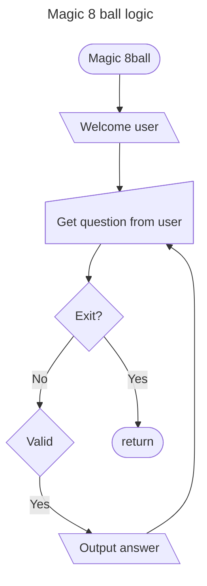

```mermaid
---
title: Magic 8 ball logic
---
flowchart TD
    A@{shape: stadium, label: "Magic 8ball"}
    B@{shape: lean-l, label: Welcome user}
    C@{shape: sl-rect, label: Get question from user}
    D@{shape: diamond, label: Exit?}
    E@{shape: diamond, label: Valid}
    F@{shape: lean-l, label: Output answer}
    Å@{shape: stadium, label: return}


    A --> B --> C --> D
    D -- No --> E -- Yes --> F --> C
    D -- Yes --> Å
```